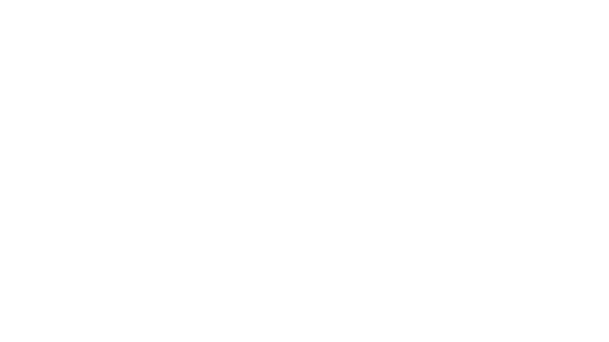

# Finance Workspace

Finance Workspace is a React and Vite dashboard for managing personal transactions, reviewing balance summaries and viewing practical finance insights from the connected API.

## Features

- Login and registration flow
- Dashboard balance and transaction summaries
- Add, edit, delete and filter transactions
- Expense and income visualizations
- Profile management, fixed responsive navigation, polished footer, and a floating go-to-top control
- Toast feedback and protected routes

## Tech stack

React, Vite, Material UI, styled-components, React Router, Recharts, Axios and React Icons.

## Run locally

    npm install
    npm run dev

The dashboard expects the existing finance API configuration used by the project.

## Deployment

Live: [https://a2rp.github.io/finance-ai-frontend/](https://a2rp.github.io/finance-ai-frontend/)

Deploy with:

    npm run deploy

## Links

- Portfolio: [https://www.ashishranjan.net/](https://www.ashishranjan.net/)
- GitHub: [https://github.com/a2rp](https://github.com/a2rp)
- CodePen: [https://codepen.io/ash1198](https://codepen.io/ash1198)
- LinkedIn: [https://www.linkedin.com/in/aashishranjan](https://www.linkedin.com/in/aashishranjan)
- Facebook: [https://www.facebook.com/theash.ashish/](https://www.facebook.com/theash.ashish/)
- YouTube: [https://www.youtube.com/@ashishranjan-ashz?sub_confirmation=1](https://www.youtube.com/@ashishranjan-ashz?sub_confirmation=1)
- Email: [ash.ranjan09@gmail.com](mailto:ash.ranjan09@gmail.com)

## Support

- Support: [https://a2rp-donation-page.netlify.app/](https://a2rp-donation-page.netlify.app/)
- Buy Me a Coffee: [https://buymeacoffee.com/a2rp](https://buymeacoffee.com/a2rp)
- Patreon: [https://patreon.com/a2rp](https://patreon.com/a2rp)
